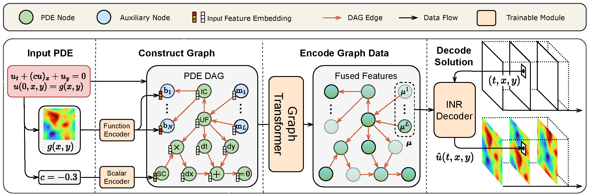

ENGLISH | [简体中文](README_CN.md)

# PDEformer-2: A Foundation Model for Two-Dimensional PDEs

## Overview

Partial differential equations (PDEs) are closely related to numerous physical phenomena and engineering applications, covering multiple fields such as airfoil design, electromagnetic field simulation, and stress analysis.
In these practical applications, solving PDE often requires repeated iterations.
Although traditional PDE solving algorithms are highly accurate, they often consume a significant amount of computational resources and time.
The neural operator methods proposed in recent years, based on deep learning, have greatly improved the speed of solving PDEs.
However, they pose difficulties to generalize to new forms of PDE, and often encounter problems such as high training costs and limited data size.

We develop the PDEformer model series to address the above issues.
This is a class of end-to-end solution prediction models that can directly handle almost **any form of PDE**, eliminating the need for customized architecture design and training for different PDEs, thereby significantly reducing model deployment costs and improving solution efficiency.
The [PDEformer-1](https://gitee.com/mindspore/mindscience/blob/master/MindFlow/applications/pdeformer1d) model developed for one-dimensional PDEs has been open-sourced previously.
The current PDEformer-2 model for two-dimensional PDEs, pretrained on a dataset of **approximately 40TB**, can directly handle 2D PDEs with different **computational domains, boundary conditions, number of variables, and time dependencies**, and quickly obtain predicted solutions at **any spatio-temporal location**.
In addition, as a **differentiable** surrogate model for solving forward problems, PDEformer-2 can also be used to solve various **inverse problems**, estimating scalar coefficients, source term fields, or wave velocity fields based on **noisy** spatio-temporal **scatter** observations.
This has laid a promising foundation for the model to support research on numerous physical phenomena and engineering applications in fields such as fluids and electromagnetics.

## Methodology

We consider two-dimensional PDEs defined on $(t,r)\in[0,1]\times\Omega$ of the generic form

$$\mathcal{F}(u_1,u_2,\dots,c_1,c_2,\dots,s_1(r),s_2(r),\dots)=0\text{ in }\Omega,$$
$$\mathcal{B}_i(u_1,u_2,\dots,c_{i1},c_{i2},\dots,s_{i1}(r),s_{i2}(r),\dots)=0\text{ on }\Gamma_i,$$

where $r=(x,y)\in\Omega\subseteq[0,1]^2$ is the spatial coordinate, $c_1,c_2,\dots,c_{11},c_{12},\dots \in \mathbb{R}$ are real-valued coefficients, $s_1(r),s_2(r)\dots,s_{11}(r),\dots$ are scalar functions (which may serve as initial conditions, boundary values or coefficient fields in the equation), and $u_1,u_2,\dots:[0,1]\times\Omega\to\mathbb{R}$ are unknown field variables to be solved in the equation.
The boundary conditions are indexed by $i=1,2,\dots$.
Here, we assume that each of the operators $\mathcal{F},\mathcal{B}_1,\mathcal{B}_2,\dots$ admits a symbolic expression, which may involve differential and algebraic operations.
The goal of PDEformer-2 is to construct a surrogate model of the solution mapping
$$(\Omega,\mathcal{F},c_1,\dots,s_1(r),\dots,\Gamma_1,\mathcal{B}_1,c_{11},\dots,s_{11}(r),\dots)\mapsto(u_1,u_2,\dots),$$
The input of this solution mapping includes the location of the computational domain $\Omega$ and the boundaries $\Gamma_1,\Gamma_2,\dots$,
the symbolic expressions of the interior operator $\mathcal{F}$ and boundary operators $\mathcal{B}_1,\mathcal{B}_2,\dots$,
as well as the numeric information $c_1,\dots,c_{11},\dots,s_1(r),\dots,s_{11}(r),\dots$ involved,
and the output includes all components of the predicted solution, i.e., $u_1,u_2,\dots:[0,1]\times\Omega\to\mathbb{R}$.
Taking the (single component) advection equation $u_t+(cu)_x+u_y=0$, $u(0,r)=g(r)$ on $\Omega=[0,1]^2$ with periodic boundary conditions as an example:



As shown in the figure, PDEformer-2 first formulates the symbolic expression of the PDE as a computational graph, and makes use of a scalar encoder and a function encoder to embed the numeric information of the PDE into the node features of the computational graph.
Then, PDEformer-2 encodes this computational graph using a graph Transformer, and decodes the resulting latent vectors using an implicit neural representation (INR) to obtain the predicted values of each solution component of PDE at specific spatio-temporal coordinates.
A more detailed interpretation of the working principle of the model can be found in the introduction of [PDEformer-1](https://gitee.com/mindspore/mindscience/blob/master/MindFlow/applications/pdeformer1d).

In terms of the complex domain shapes and boundary locations that may appear in two-dimensional equations, PDEformer-2 represents them as signed distance functions (SDFs), and embeds this information into the computational graph using the function encoder.
The example shown in the following figure demonstrates the way of using computational graphs to represent Dirichlet boundary conditions on a square domain:


## Installation

Please first make sure that MindSpore is successfully installed, as instructed in the [Installation Tutorial](https://www.mindspore.cn/install).
Other dependencies can be installed using the following command:

```bash
pip3 install -r pip-requirements.txt
```

## Model Running

We provide configuration files for PDEformer models with different numbers of parameters in the [configs/inference](configs/inference) folder.
The details are as follows:

| Model | Parameters | Configuration File | Checkpoint File |
| ---- | ---- | ---- | ---- |
| PDEformer-2-base | 82.65M | [configs/inference/model-L.yaml](configs/inference/model-L.yaml) | [model-L.ckpt](https://ai.gitee.com/functoreality/PDEformer2-L/blob/master/model-L.ckpt) |
| PDEformer-2-fast | 71.07M | [configs/inference/model-M.yaml](configs/inference/model-M.yaml) | [model-M.ckpt](https://ai.gitee.com/functoreality/PDEformer2-M/blob/master/model-M.ckpt) |
| PDEformer-2-small | 27.75M | [configs/inference/model-S.yaml](configs/inference/model-S.yaml) | [model-S.ckpt](https://ai.gitee.com/functoreality/PDEformer2-S/blob/master/model-S.ckpt) |

PDEformer-2-small (i.e., the S model) is only provided for users requiring faster inference.
We have not evaluate its performance systematically.

### Inference Example

The example code below demonstrates how to use PDEformer-2 to predict the solution of a given PDE,
taking the nonlinear conservation law $u_{t}+(u^2)_x+(-0.3u)_y=0$ (with periodic boundary conditions) as the example.
Before running, it is necessary to download the pretrained PDEformer-2-fast weights `model-M.ckpt` from [Gitee AI](https://ai.gitee.com/functoreality/PDEformer2-M/blob/master/model-M.ckpt),
and change the value of the `model.load_ckpt` entry in [configs/inference/model-M.yaml](configs/inference/model-M.yaml) to the path of the corresponding weight file.

```python
import numpy as np
from mindspore import context
from src import load_config, get_model, PDENodesCollector
from src.inference import infer_plot_2d, x_fenc, y_fenc

# Basic Settings
context.set_context(mode=context.PYNATIVE_MODE, device_target="CPU")
config = load_config("configs/inference/model-M.yaml")
model = get_model(config)

# Specify the PDE to be solved
pde = PDENodesCollector()
u = pde.new_uf()
u_ic = np.sin(2 * np.pi * x_fenc) * np.cos(4 * np.pi * y_fenc)
pde.set_ic(u, u_ic, x=x_fenc, y=y_fenc)
pde.sum_eq0(pde.dt(u), pde.dx(pde.square(u)), pde.dy(-0.3 * u))

# Predict the solution using PDEformer (with spatial resolution 32) and plot
pde_dag = pde.gen_dag(config)
x_plot, y_plot = np.meshgrid(np.linspace(0, 1, 32), np.linspace(0, 1, 32), indexing="ij")
u_pred = infer_plot_2d(model, pde_dag, x_plot, y_plot)
```

For more examples, please refer to the interactive notebook [PDEformer_inference.ipynb](PDEformer_inference.ipynb).

### finetuning

PDEformer-2 has acquired the capability to solve forward problems for various types of PDEs through pretraining.
The shared knowledge underlying these diverse PDE-solving tasks provides a solid foundation for PDEformer-2 to quickly adapt to solving new equations.
We can finetune the pretrained PDEformer-2 model using standard datasets to evaluate its ability to adapt to new scenarios and tasks.
Here, we take the 2D shallow-water equation (radial dam break) data from the PDEBench dataset as an example, finetuning the model with just a single sample and testing its prediction accuracy on 100 test samples.
The finetuning process follows these steps:

* (1) Download the pretrained PDEformer-2 weights `model-M.ckpt` from [Gitee AI](https://ai.gitee.com/functoreality/PDEformer2-M/blob/master/model-M.ckpt);
* (2) Download the data file [2D_rdb_NA_NA.h5](https://darus.uni-stuttgart.de/api/access/datafile/133021) from PDEBench;
* (3) Modify the configuration file [configs/finetune/pdebench-swe-rdb_model-M.yaml](configs/finetune/pdebench-swe-rdb_model-M.yaml)
	to specify the paths for the downloaded model weights (`model.load_ckpt` entry) and the dataset folder (`data.path` entry):

```yaml
# ...
model:
  # ...
  load_ckpt: path/to/your/downloaded/model-M.ckpt  # path to the pretrained model weights
data:
  path: ../data_download  # directory of the dataset
  num_samples_per_file:
    train: 1  # training dataset samples
    test: 100  # test dataset samples
  # ...
  single_pde:
    param_name: rdb  # PDE dataset type, here radial-dam-break
    train: [1]  # list of PDE parameters. RDB has no parameter, so anything works.
# ...
```

* (4) After completing the modifications to the configuration file, launch the single-NPU finetuning task by running the following command:

```bash
config_path=configs/finetune/pdebench-swe-rdb_model-M.yaml
python train.py -c $config_path --no_distributed --device_id 0
```

Users can also finetune the model with other datasets.
For example, if using the INS-Tracer equation data mentioned in the paper, the data file to download in step (2) becomes:
[dedalus_v5.1_Baseline2D_INSTracer_icA_noP_db1_nu0.001D0.01_seed0.hdf5](https://data-download.obs.cn-northeast-227.dlaicc.com/dedalus_v5.1/Baseline2D/dedalus_v5.1_Baseline2D_INSTracer_icA_noP_db1_nu0.001D0.01_seed0.hdf5).
(For more details on downloading data files, please refer to the [PDEFoundry-2](https://github.com/functoreality/pdefoundry-2) repository.)
Meanwhile, the configuration file to modify in step (3) is [configs/finetune/ins-tracer_model-M.yaml](configs/finetune/ins-tracer_model-M.yaml).
The command for step (4) using 8 NPUs for finetuning is as follows:

```bash
# path to the config file
config_path=configs/finetune/ins-tracer_model-M.yaml

# train model with 8 Ascend NPUs
mpirun -n 8 --output-filename log_output --merge-stderr-to-stdout \
    python train.py --config_file_path $config_path
```

### pretraining

The dataset used for PDEformer-2 pretraining and the corresponding data generation code can be obtained from [PDEFoundry-2](https://github.com/functoreality/pdefoundry-2).
Due to the excessively large scale of the full pretraining dataset, the pretraining process demonstrated here uses only a small subset of the data.
The steps are as follows:

* (1) Download the small-scale pretraining dataset using [this Bash script](https://github.com/functoreality/pdefoundry-2/blob/main/download/pdefoundry2_small_data.sh).
* (2) Modify the configuration file [configs/pretrain/model-L_small-data.yaml](configs/pretrain/model-L_small-data.yaml) to specify the dataset folder (`data.path` entry).
* (3) Launch the 8-NPU parallel pretraining by running the following command:

```bash
bash scripts/train_distributed.sh
```

## Citation

If you find this work helpful for you, please kindly consider citing our paper:

```bibtex
@misc{pdeformer2,
      title={PDEformer-2: A Versatile Foundation Model for Two-Dimensional Partial Differential Equations},
      author={Zhanhong Ye and Zining Liu and Bingyang Wu and Hongjie Jiang and Leheng Chen and Minyan Zhang and Xiang Huang and Qinghe Meng. Jingyuan Zou and Hongsheng Liu and Bin Dong},
      year={2025},
      eprint={2507.15409},
      archivePrefix={arXiv},
      primaryClass={math.NA},
      url={https://arxiv.org/abs/2507.15409},
}
```
