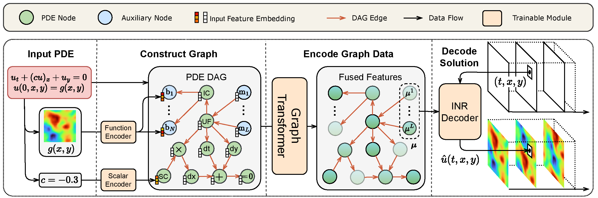
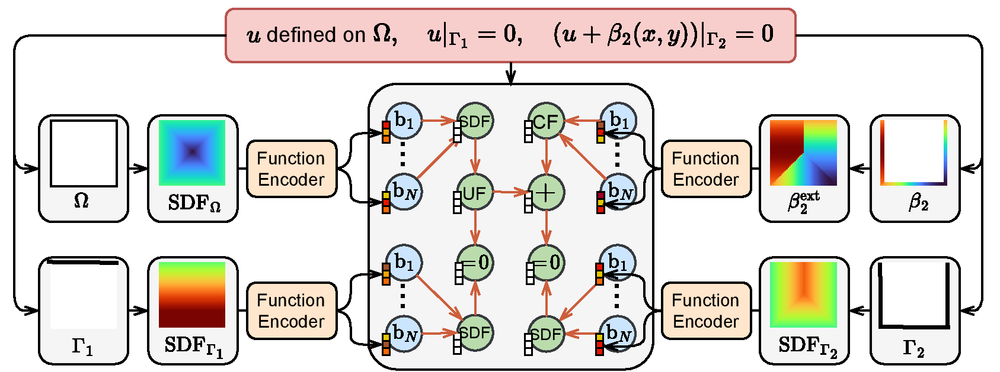

[ENGLISH](README.md) | 简体中文

# PDEformer-2: 面向二维 PDE 的基础模型

## 概述

偏微分方程（PDE）与众多物理现象和工程应用紧密相联，涵盖机翼设计、电磁场模拟、应力分析等多个领域。
在这些实际应用中，PDE 的求解往往需要反复进行。
传统的 PDE 求解算法尽管十分精确，但往往会消耗大量的计算资源和时间。
近年提出的基于深度学习的神经算子（neural operator）方法极大地提高了 PDE 的求解速度，但难以泛化到新的 PDE 形式，且往往遇到训练代价高和数据量有限的问题。

针对以上问题，我们开发了 PDEformer 系列模型。
这是一种可以直接处理几乎**所有 PDE 形式**的端到端解预测模型，无需对不同 PDE 进行定制化的架构设计与训练，从而明显降低了模型部署成本，提升了求解效率。
针对一维 PDE 的 [PDEformer-1](https://gitee.com/mindspore/mindscience/blob/master/MindFlow/applications/pdeformer1d) 模型已于之前开源。
当前针对二维 PDE 的 PDEformer-2 模型使用**约 40TB** 的数据集进行预训练，能够对具有不同**方程定义域、边界条件、变量个数、时间依赖情况**的二维方程进行直接推理，快速获得**任意时空位置**的预测解。
此外，作为正问题解算子的**可微分**代理模型，PDEformer-2 还可以用于求解各类**反问题**，基于**有噪声**的**时空散点**观测，估计方程中的标量系数、源项场或波速场。
这为模型支持包括流体、电磁等领域的众多物理现象、工程应用的研究打下了良好的基础。

## 技术路径

我们考虑定义在 $(t,r)\in[0,1]\times\Omega$ 上的二维偏微分方程（PDE），其一般形式为

$$\mathcal{F}(u_1,u_2,\dots,c_1,c_2,\dots,s_1(r),s_2(r),\dots)=0\text{ in }\Omega,$$
$$\mathcal{B}_i(u_1,u_2,\dots,c_{i1},c_{i2},\dots,s_{i1}(r),s_{i2}(r),\dots)=0\text{ on }\Gamma_i,$$

其中 $r=(x,y)\in\Omega\subseteq[0,1]^2$ 是空间坐标，$c_1,c_2,\dots,c_{11},c_{12},\dots \in \mathbb{R}$ 是实值系数，$s_1(r),s_2(r)\dots,s_{11}(r),\dots$ 是标量函数（在方程中可作为初值、边值、系数场等），$u_1,u_2,\dots:[0,1]\times\Omega\to\mathbb{R}$ 是待求解物理场的各个分量。
多个边界条件分别由指标 $i=1,2,\dots$ 表示。
在这里，我们假设算子 $\mathcal{F,B}_1,\mathcal{B}_2\dots$ 具有符号表达式，其中可能涉及微分和代数运算。
PDEformer-2 的目标是构建一个方程解的代理模型，形式为
$$(\Omega,\mathcal{F},c_1,\dots,s_1(r),\dots,\Gamma_1,\mathcal{B}_1,c_{11},\dots,s_{11}(r),\dots)\mapsto(u_1,u_2,\dots),$$
它将 PDE 的定义域与边界位置 $\Omega,\Gamma_1,\Gamma_2,\dots$，符号形式 $\mathcal{F,B}_1,\mathcal{B}_2\dots$ 及其中涉及的数值信息 $c_1,\dots,c_{11},\dots,s_1(r),\dots,s_{11}(r),\dots$ 作为输入，输出相应方程的预测解 $u_1,u_2,\dots:[0,1]\times\Omega\to\mathbb{R}$。
以 $\Omega=[0,1]^2$ 上具有周期边界条件的（单分量）对流方程 $u_t+(cu)_x+u_y=0$，$u(0,r)=g(r)$ 为例：



如图所示，PDEformer-2 先将方程形式表示为一个计算图，利用标量、函数编码器将方程涉及的数值信息嵌入到计算图的节点特征当中。
接下来，PDEformer-2 通过 graph Transformer 编码这一计算图，并使用隐式神经表征（INR）对所得的隐向量进行解码，获得 PDE 的各个解分量在特定时空坐标下的预测值。
关于模型工作原理的更详细解释可以在 [PDEformer-1](https://gitee.com/mindspore/mindscience/blob/master/MindFlow/applications/pdeformer1d) 的介绍中找到。

对于二维方程中可能出现的复杂区域形状和边界位置，PDEformer-2 将其表示为符号距离函数（SDF），并使用函数编码器将这部分信息嵌入到计算图当中。
下图所示的例子展示了使用计算图表示方形区域上 Dirichlet 边界条件的方式：



## 安装

首先确保 MindSpore 已成功安装，见 [安装教程](https://www.mindspore.cn/install)。
其他依赖库可以通过如下命令安装：

```bash
pip3 install -r pip-requirements.txt
```

## 文件目录结构

由于本仓库文件较多，以下仅列出主要文件。
完整的文件目录结构请参见 [docs/FILE_TREE_CN.md](docs/FILE_TREE_CN.md)。

```text
./
│  dynamic_dataset_manager.py                    # 数据集动态缓冲区管理程序，在大数据量（超出本地磁盘容量）预训练开始前启动
│  inverse_function.py                           # 反问题代码，估计 PDE 中的函数（源项、波方程速度场）
│  inverse_scalar.py                             # 反问题代码，估计 PDE 中的标量（方程系数）
│  PDEformer_inference.ipynb                     # 英文版模型预测交互式 notebook
│  PDEformer_inference_CN.ipynb                  # 中文版模型预测交互式 notebook
│  pip-requirements.txt                          # Python 依赖库
│  preprocess_data.py                            # 预处理数据、生成计算图，并将结果保存到新建的辅助数据文件中
│  README.md                                     # 英文版说明文档
│  README_CN.md                                  # 中文版说明文档
│  train.py                                      # 模型训练代码
├─configs                                        # 配置文件目录
│      ...
├─docs                                           # 附加说明文档
│      ...
├─scripts                                        # 用于启动训练、微调、反问题求解的 shell 脚本
│      ...
└─src                                            # 基础代码目录
       ...
```

## 模型运行

我们在 [configs/inference](configs/inference) 文件夹下提供了不同参数量的 PDEformer-2 模型的配置文件。
具体如下表所示：

| 模型 | 参数量 | 配置文件 | 预训练权重文件 |
| ---- | ---- | ---- | ---- |
| PDEformer-2-base | 82.65M | [configs/inference/model-L.yaml](configs/inference/model-L.yaml) | [model-L.ckpt](https://ai.gitee.com/functoreality/PDEformer2-L/blob/master/model-L.ckpt) |
| PDEformer-2-fast | 71.07M | [configs/inference/model-M.yaml](configs/inference/model-M.yaml) | [model-M.ckpt](https://ai.gitee.com/functoreality/PDEformer2-M/blob/master/model-M.ckpt) |
| PDEformer-2-small | 27.75M | [configs/inference/model-S.yaml](configs/inference/model-S.yaml) | [model-S.ckpt](https://ai.gitee.com/functoreality/PDEformer2-S/blob/master/model-S.ckpt) |

其中 PDEformer-2-small（即 S 模型）仅为需要更快推理时间的用户提供。
我们并未系统地评估它的性能。

### 推理示例

下面的示例代码展示了如何使用 PDEformer-2 预测给定 PDE 的解，以非线性守恒律方程 $u_{t}+(u^2)_x+(-0.3u)_y=0$ （周期边界）为例。
运行前需要先从 [Gitee AI](https://ai.gitee.com/functoreality/PDEformer2-M/blob/master/model-M.ckpt) 下载经过预训练的 PDEformer-2-fast 权重 `model-M.ckpt`，
并将 [configs/inference/model-M.yaml](configs/inference/model-M.yaml) 中 `model.load_ckpt` 参数的值改为相应的权重文件路径。

```python
import numpy as np
from mindspore import context
from src import load_config, get_model, PDENodesCollector
from src.inference import infer_plot_2d, x_fenc, y_fenc

# 基本设定
context.set_context(mode=context.PYNATIVE_MODE, device_target="CPU")
config, _ = load_config("configs/inference/model-M.yaml")
model = get_model(config)

# 指定待求解的 PDE
pde = PDENodesCollector()
u = pde.new_uf()
u_ic = np.sin(2 * np.pi * x_fenc) * np.cos(4 * np.pi * y_fenc)
pde.set_ic(u, u_ic, x=x_fenc, y=y_fenc)
pde.sum_eq0(pde.dt(u), pde.dx(pde.square(u)), pde.dy(-0.3 * u))

# 使用 PDEformer 预测解（空间分辨率 32）并绘图
pde_dag = pde.gen_dag(config)
x_plot, y_plot = np.meshgrid(np.linspace(0, 1, 32), np.linspace(0, 1, 32), indexing="ij")
u_pred = infer_plot_2d(model, pde_dag, x_plot, y_plot)
```

更多的示例见 [PDEformer_inference_CN.ipynb](PDEformer_inference_CN.ipynb)。

### 微调

PDEformer-2 通过预训练掌握了多种不同类型 PDE 的正问题求解能力。
这些多样 PDE 求解任务背后的共享知识为 PDEformer-2 快速适应新方程的求解打下了良好的基础。
我们可以使用一些标准数据集对预训练后的 PDEformer-2 模型进行微调，以评估它适配新场景、新任务的能力。
这里以 PDEBench 数据集中的 2D 浅水波（径向溃坝）数据为例，仅使用单个样本微调模型，并测试模型在 100 个测试样本上的预测精度。
微调过程依照如下几个步骤进行：

* (1) 从 [Gitee AI](https://ai.gitee.com/functoreality/PDEformer2-M/blob/master/model-M.ckpt) 下载经过预训练的 PDEformer-2 权重 `model-M.ckpt`；
* (2) 下载 PDEBench 数据集中的 [2D_rdb_NA_NA.h5](https://darus.uni-stuttgart.de/api/access/datafile/133021)；
* (3) 修改配置文件 [configs/finetune/pdebench-swe-rdb_model-M.yaml](configs/finetune/pdebench-swe-rdb_model-M.yaml)，
	指定下载所得的的模型权重文件路径（`model.load_ckpt` 参数）与数据集所在的文件夹（`data.path` 参数）：

```yaml
# ...
model:
  # ...
  load_ckpt: path/to/your/downloaded/model-M.ckpt  # 预训练模型权重路径
data:
  path: ../data_download  # 数据集所在目录
  num_samples_per_file:
    train: 1  # 训练数据集样本数
    test: 100  # 测试数据集样本数
  # ...
  single_pde:
    param_name: rdb  # 方程数据集类型（有时还有参数名），这里为径向溃坝（RDB）数据
    train: [1]  # 方程参数值列表。当前所用的 RDB 数据集不包含参数，因此随意设置即可
# ...
```

* (4) 完成配置文件的修改后，通过运行如下命令来启动单机单卡的微调任务：

```bash
config_path=configs/finetune/pdebench-swe-rdb_model-M.yaml
python train.py -c $config_path --no_distributed --device_id 0
```

用户也可以使用其他数据来进行微调。
例如，如果使用论文中所涉及的 INS-Tracer 方程数据，以上第 (2) 步要下载的数据文件变成
[dedalus_v5.1_Baseline2D_INSTracer_icA_noP_db1_nu0.001D0.01_seed0.hdf5](https://data-download.obs.cn-northeast-227.dlaicc.com/dedalus_v5.1/Baseline2D/dedalus_v5.1_Baseline2D_INSTracer_icA_noP_db1_nu0.001D0.01_seed0.hdf5)
（关于数据文件下载的更多说明请见 [PDEFoundry-2](https://github.com/functoreality/pdefoundry-2) 仓库），
而步骤 (3) 需要修改的配置文件则是 [configs/finetune/ins-tracer_model-M.yaml](configs/finetune/ins-tracer_model-M.yaml)。
步骤 (4) 使用单机 8 卡微调的命令如下：

```bash
# path to the config file
config_path=configs/finetune/ins-tracer_model-M.yaml

# train model with 8 Ascend NPUs
mpirun -n 8 --output-filename log_output --merge-stderr-to-stdout \
    python train.py --config_file_path $config_path
```

### 预训练

PDEformer-2 预训练使用的数据集和相应的数据生成代码可以在 [PDEFoundry-2](https://github.com/functoreality/pdefoundry-2) 获取。
由于完整的预训练数据集规模过大，这里展示的预训练过程仅使用其中的少量数据。
按如下步骤进行：

* (1) 使用 [这个 Bash 脚本](https://github.com/functoreality/pdefoundry-2/blob/main/download/pdefoundry2_small_data.sh) 下载小规模预训练所需的数据集。
* (2) 调整配置文件 [configs/pretrain/model-L_small-data.yaml](configs/pretrain/model-L_small-data.yaml)，指定数据集所在的文件夹（`data.path` 参数）。
* (3) 通过运行如下命令来运行单机 8 卡的并行预训练：

```bash
bash scripts/train_distributed.sh
```

### 反问题

## 贡献者

GitHub id: TODO

email: TODO
